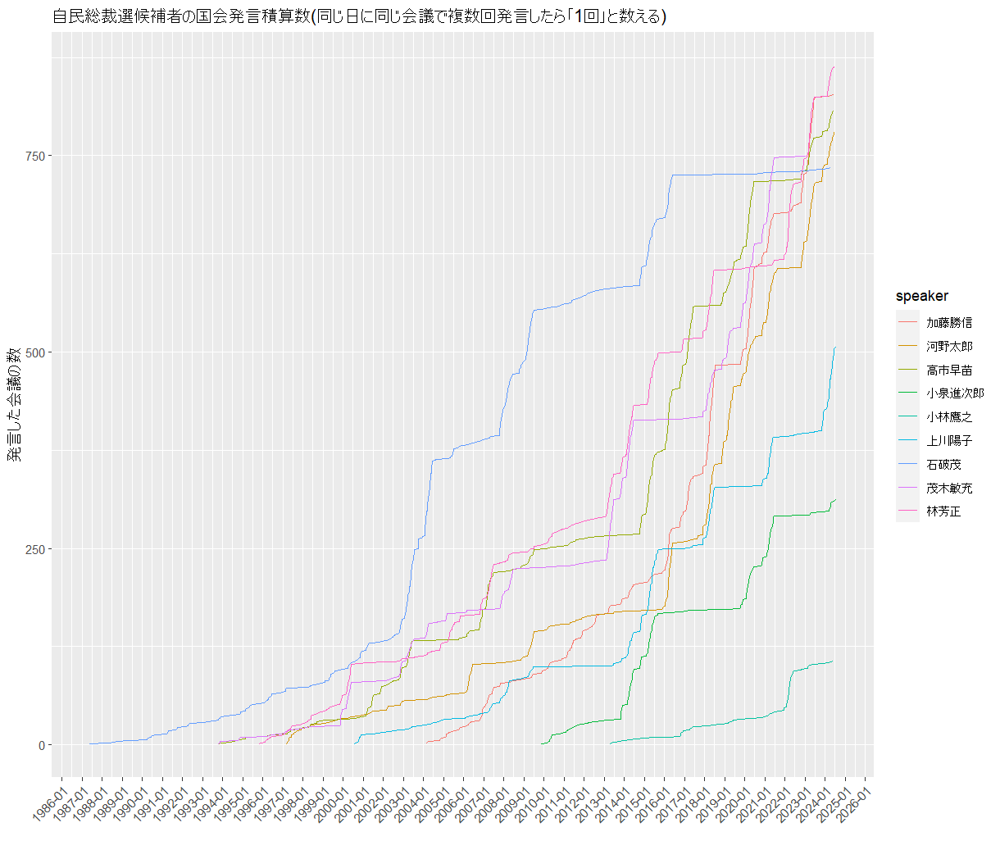

# 自民総裁選の9候補、国会での発言回数は？


<div align="right">
朝日新聞デジタル企画報道部　小宮山亮磨  <br>
@ryomakom  <br>
2024/9/26  </div>


2024年の自民党総裁選の9候補が過去に国会でどれだけの回数の発言をしてきたかをまとめて、朝日新聞で[報じました](https://digital.asahi.com/articles/ASS9R0VFKS9RULLI002M.html)（紙の新聞では夕刊の社会総合面に掲載されました）。データは国立国会図書館の[国会会議録検索システムAPI](https://kokkai.ndl.go.jp/api.html)を使ってとってきたものです。


APIに使うURLを次から次に生成して、自動的にデータをとってくるようにしたです。とくに複雑なことはやっていませんが、ひとつだけ注意したほうがいいのは、APIであまりにも大量のリクエストを送ると攻撃と勘違いされて、接続が遮断されてしまいます（私もやりました。ほとぼりが冷めるのに20分くらいかかったかな？）。なので、次のリクエストまでは少し間隔を空けてやる必要があります。私の場合、3秒空けたら問題は起きませんでした。

というわけで、コードを以下に記録しておきます。

```{r}
# 必要なパッケージをとってくる

library(tidyverse)
library(glue)
library(httr)
library(xml2)
library(utils)

# 保存するフォルダのパスを指定
ldp_dir <- "data/records/ldp_candidates"

# 総裁選候補者の名前リスト
ldp_cand_list <- c("加藤勝信",
                   "小林鷹之",
                   "石破茂",
                   "河野太郎",
                   "林芳正",
                   "茂木敏充",
                   "小泉進次郎",
                   "高市早苗",
                   "上川陽子")

# 各候補者についてAPIで発言を抽出し、結果のxmlファイルをローカルに保存
for (speaker in ldp_cand_list) {
  start_record <- 1  # 初期値は1
  
  repeat {
    # 発言者名、startRecordをURLに組み込む
    base_url <- glue("https://kokkai.ndl.go.jp/api/speech?maximumRecords=100&startRecord={start_record}&speaker={URLencode(speaker, reserved = TRUE)}")
    
    # HTTPリクエストを送信し、XMLデータを取得
    response <- GET(base_url)
    
    # レスポンスが成功した場合のみ処理を続行
    if (status_code(response) == 200) {
      # XMLデータをパース
      xml_content <- content(response, "text")
      parsed_xml <- read_xml(xml_content)
      
      # numberOfRecordsとnextRecordPositionを取得
      number_of_records <- as.integer(xml_text(xml_find_first(parsed_xml, "//numberOfRecords")))
      next_record_position <- as.integer(xml_text(xml_find_first(parsed_xml, "//nextRecordPosition")))
      
      # 保存先ファイル名を作成 (発言者名、スタートレコードを含むファイル名)
      file_name <- glue("speaker_{speaker}_start_{start_record}.xml")
      file_path <- file.path(ldp_dir, file_name)
      
      # ローカルにXMLデータを保存
      write(xml_content, file = file_path)
      print(glue("Saved: {file_path}"))
      
      # ダウンロードを終了する条件
      if (is.na(next_record_position) || start_record >= number_of_records) {
        print(glue("All records for speaker {speaker} have been downloaded."))
        break
      }
      
      # 次のリクエストのstartRecordを更新
      start_record <- next_record_position
      
    } else {
      # リクエストが失敗した場合、エラーメッセージを表示して終了
      print(glue("Failed to retrieve data for speaker {speaker}."))
      break
    }
    
    # 3秒間の間隔を設ける
    Sys.sleep(3)
  }
}


# 保存したXMLファイルをリストに
ldp_xml_files <- list.files(ldp_dir, pattern = "\\.xml$", full.names = TRUE)

# データを保存するリストを初期化
ldp_cand_data <- list()

# 各XMLファイルに対してループ
for (xml_file in ldp_xml_files) {
  # XMLファイルを読み込む
  xml_data <- read_xml(xml_file)
  
  # numberOfRecordsを抽出
  number_of_records <- xml_text(xml_find_first(xml_data, "//numberOfRecords"))
  
  # 'record' 要素をループで処理
  records <- xml_find_all(xml_data, ".//recordData/speechRecord")
  
  # ファイル名を取得
  file_name <- basename(xml_file)  # ファイル名を抽出
  
  for (record in records) {
    speech_id <- xml_text(xml_find_first(record, "speechID"))
    session <- xml_text(xml_find_first(record, "session"))
    name_of_house <- xml_text(xml_find_first(record, "nameOfHouse"))
    name_of_meeting <- xml_text(xml_find_first(record, "nameOfMeeting"))
    issue <- xml_text(xml_find_first(record, "issue"))
    date <- xml_text(xml_find_first(record, "date"))
    speech_order <- xml_text(xml_find_first(record, "speechOrder"))
    speaker <- xml_text(xml_find_first(record, "speaker"))
    speaker_group <- xml_text(xml_find_first(record, "speakerGroup"))
    speech <- xml_text(xml_find_first(record, "speech"))
    speech_url <- xml_text(xml_find_first(record, "speechURL"))
    speaker_position <- xml_text(xml_find_first(record, "speakerPosition"))
    speaker_role <- xml_text(xml_find_first(record, "speakerRole"))
    
    # リストにデータを追加（ファイル名も保存）
    ldp_cand_data[[length(ldp_cand_data) + 1]] <- tibble(
      speech_id = speech_id,
      session = session,
      name_of_house = name_of_house,
      name_of_meeting = name_of_meeting,
      issue = issue,
      date = date,
      speech_order = speech_order,
      speaker = speaker,
      speaker_group = speaker_group,
      speech = speech,
      speech_url = speech_url,
      number_of_records = number_of_records,  # numberOfRecordsも保存
      speaker_position = speaker_position,
      speaker_role = speaker_role,
      file_name = file_name  # ファイル名を保存
    )
  }
}


# データをtibbleにまとめる
ldp_cand_speeches <- bind_rows(ldp_cand_data) %>% 
  select(speaker,speaker_group,speaker_position,speaker_role,
         session,name_of_house,name_of_meeting,issue,date,speech_order,
         speech,speech_id,speech_url,number_of_records,file_name) %>% 
  mutate(speaker_position=ifelse(speaker_position=="",NA,speaker_position),
         speaker_role=ifelse(speaker_role=="",NA,speaker_role))

first_speech_date <- ldp_cand_speeches %>% 
  group_by(speaker) %>% 
  summarize(min_date = min(date)) %>% 
  distinct(speaker,min_date)

ldp_cand_speeches %>% group_by(speaker) %>% summarize(n=n()) %>% left_join(ldp_cand_speeches %>% distinct(speaker,number_of_records)) %>% mutate(dif=n-as.double(number_of_records)) %>% arrange(dif) %>% view()


ldp_cand_history <- ldp_cand_speeches %>% 
  filter(speaker != "小林芳正") %>%  # 名寄せの失敗で混入していた海難審判庁の人を除去
  distinct(speaker, speaker_position, speaker_role, session, name_of_house, name_of_meeting, date) %>%
  group_by(speaker, date) %>%
  summarize(n = n(), .groups = "drop") %>%
  group_by(speaker) %>%
  mutate(total_speeches = cumsum(n)) %>%
  left_join(ldp_cand_speeches %>% distinct(speaker,date,speaker_position)) %>% 
  mutate(date = as.Date(date)) %>% 
  ggplot(aes(x = date,
             y = total_speeches,
             color = speaker,
             group = speaker,
             text = speaker_position)) +  # text引数でtooltipにspeaker_positionを追加
  geom_line() +
  labs(
    title = "自民総裁選候補者の国会発言積算数(同じ日に同じ会議で複数回発言したら「1回」と数える)",
    x = "",
    y = "発言した会議の数"
    ) +
  scale_x_date(date_breaks = "1 year", date_labels = "%Y-%m") +
  theme(axis.text.x = element_text(angle = 45, hjust = 1))  # 45度斜めにして表示

```



グラフはFlourishでも[見られる](https://public.flourish.studio/visualisation/19452928/)ようにしてあります。

以上。
